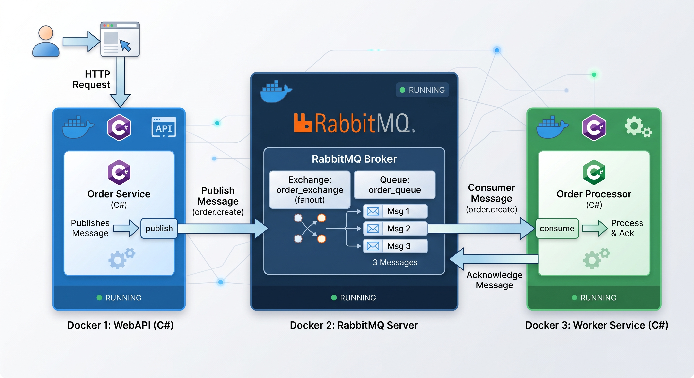

# RabbitMQ Tutorial with C#

This is an example on how to Produce and Consume a message in a RabbitMQ environment.

## Architecture

## Pre-requisites

The applications is developed to run in a **Docker Composer**, so you don't need anything besides de **Docker Desktop** installed on your machine.

## Setup

Copy the file `.env.example` to `.env`
Just change the `RABBIT_USER` and `RABBIT_PASS` values.

## Running

If you are in a Windows environment, in a Terminal or in a Powershell console, just type:
`.\run-composition.ps1`

If you are in another environment, in a Terminal console, just type:
`docker compose up --build -d`

## How to use it

Send a POST request, to the `http//localhost:5169` with the JSON body, for example:
{
    "id": 1,
    "name": "Product name",
    "value": 18.99
}

## Logging

To followup the process, all actions will be logged in:
`dockerdata/producer`: all data received from requests
`dockerdata/consumer`: all messages consumed from the queue

